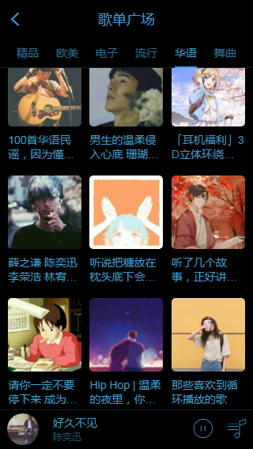
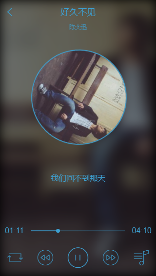

# 未知音乐
>参网易云音乐原生APP，vue练手项目，点击[预览项目](http://120.79.55.93)
## 前言
在学习vue后想找个项目练手，鉴于听音乐的爱好，选择了参网易云音乐做了此项目。过程踩坑无数，但也不得不说组件化开发的爽
## 技术栈
>vue2.x/vuex/vue-router/axios/es6/stylue/swiper/better-scroll/vue-lazyload
## 关于接口
感谢大神提供的Node.js API服务：[网易云音乐API](https://binaryify.github.io/NeteaseCloudMusicApi)
## 功能
- 首页
  - banner
  - 导航
  - 推荐
- 歌单页
  - 歌单列表
  - 歌单列表上拉加载
- 排行榜页
- 歌单详情页
- 歌曲播放页
  - 播放器基本功能（播放、暂停、上一曲、下一曲、模式切换、进度条）
  - 播放图片动画
  - 歌词条件展示及其轮播
  - 播放列表
- mini播放器
  - 歌曲信息展示
  - 左右滑动切换歌曲
  - 播放列表
- 播放列表本地存储
## TODO
  - 歌手页
  - 搜索页
  - 个人中心页
  - 页面优化（页面进入的流畅性，加载速度等）
## 项目截图

## 写在最后
此项目后收获颇多，对vue的使用更加熟练同时加深了对其的理解，项目还有许多需要改进的地方，后边会陆续操作。