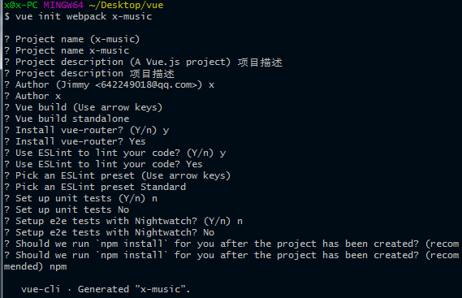
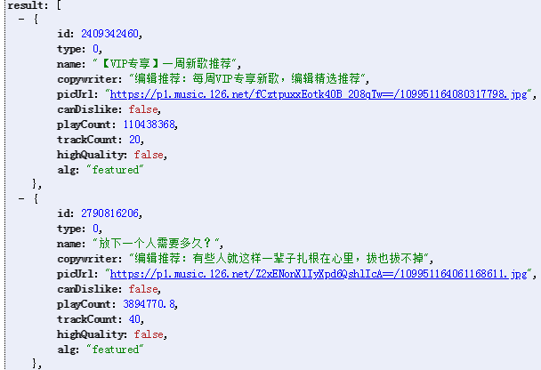
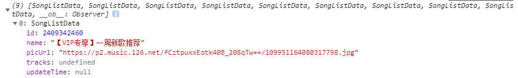
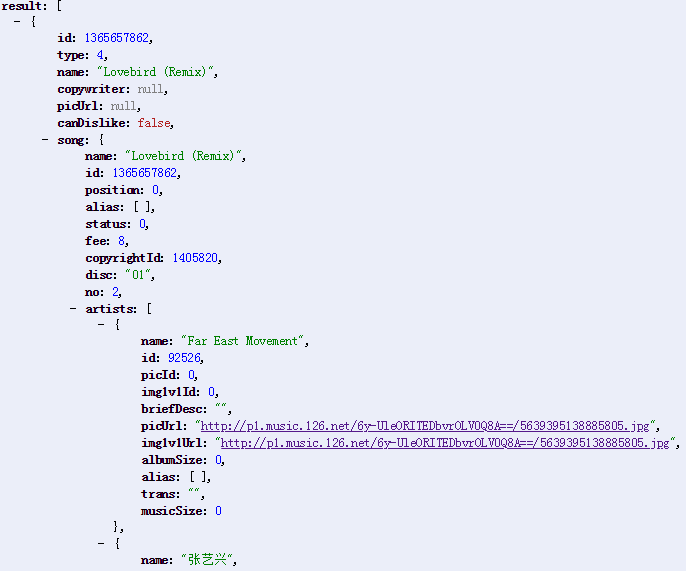

# 未知音乐-项目总结
>基于vue的一个个人音乐播放器项目
## 项目创建
### 环境搭建
使用vue我们需要借助node，下载地址：http://nodejs.cn/ ，下载完后根据安装提示进行node安装，安装完毕需要借助node的npm包管理工具安装项目所需的依赖包，若npm安装速度过慢，可用淘宝镜像cnpm，命令行输入：
```
$ npm install -g cnpm --registry=https://registry.npm.taobao.org
```
这里还使用了Git工具，下载地址：https://git-scm.com/ ，也可用cmd (windows)
### 安装vue
在用 vue.js 构建大型应用时推荐使用 npm 安装，npm 能很好地和诸如 webpack 或 browserify 模块打包器配合使用。vue.js 也提供配套工具来开发单文件组件。
```
npm install vue
```
### 安装vue-cli脚手架构建工具
```
npm install -g vue-cli
```
### 初始化项目
```
vue init webpack x-music
```
用户选项,根据需要进行选择   

   

项目初始化完成后
```
cd x-music
npm run dev
```
就可以开启运行项目了
关于vue-cli目录结构就不介绍了
### 使用git
#### git初始化（创建本地仓库）
```
git init
```
#### 连接远程仓库（GitHub）
在GitHub添加远程仓库，远程仓库创建完毕复制仓库地址
```c
git remote add origin git@github.com:Jimmy-xiang/x-music.git  // ssh方式需要预先配置秘钥
```
常用git命令
```c
git add readme.md  // 对指定文件进行跟踪
git add .  // 添加对当前文件夹的所有文件进行跟踪
git commit -m '提交说明'  // 暂存已修改文件
git status  // 检查当前文件状态
git push origin master  // 推送数据到远程仓库
git branch  //查看本地分支
git branch -r  //查看远程分支
git checkout branchname  // 移动到branchname分支
git checkout -b branchname  // 创建并移到新分支branchname
git rm readme.md  // 从暂存区移除文件
git reset HEAD <readme.md>  // 取消暂存文件
```
## 项目开发
>此项目用的css预处理器是stylus
### 文件目录
```
|-- build                            // 项目构建(webpack)相关代码
|   |-- build.js                     // 生产环境构建代码
|   |-- check-version.js             // 检查node、npm等版本
|   |-- dev-server.js                // 构建本地服务器
|   |-- utils.js                     // 构建工具相关
|   |-- webpack.base.conf.js         // webpack基础配置
|   |-- webpack.dev.conf.js          // webpack开发环境配置
|   |-- webpack.prod.conf.js         // webpack生产环境配置
|-- config                           // 项目开发环境配置
|   |-- dev.env.js                   // 开发环境变量
|   |-- index.js                     // 项目一些配置变量
|   |-- prod.env.js                  // 生产环境变量
|-- src                              // 源码目录
|   |-- api                          // 访问后台接口
|   |--  base                        // 基础组件（不做业务逻辑组件）
|   |-- common                       // 公共文件（fonts, image, js, styles）
|   |-- components                   // vue公共组件
|   |-- router                       // 路由相关
|   |-- store                        // vuex的状态管理
|   |-- App.vue                      // 页面入口文件
|   |-- main.js                      // 程序入口文件，加载各种公共组件
|-- static                           // 静态文件，比如一些图片，json数据等
|-- .babelrc                         // ES6语法编译配置,里面有一些插件，这些插件的作用是代码的转换
|-- .editorconfig                    // 编译器的配置,定义代码格式
|-- .eslintignore                    //忽略语法检查的目录文件
|-- .eslintrc.js                     //编译规则配置文件，规则定制文件，规则编译不过的时候可以在这里配置为0
|-- .gitignore                       // git上传需要忽略的文件格式,
|-- favicon.ico                      // link图标
|--.postcssrc.js
|-- index.html                       // 入口页面
|-- package.json                     // 项目基本信息如：可以配置script脚本  ^上箭头代表可以安装当前版本及以上的版本
|-- README.md                        // 项目说明
```
---
**关于浏览器标签栏图标**   

在index.html中添加link标签
```html
<link rel="shortcut icon" href="./favicon.ico" type="image/x-icon">
```
**styles中的文件**  

reset.styl -- 样式初始化文件  
base.styl -- 初始化样式，二次设置html,body标签的初始样式  
border.css -- 解决移动端的一像素边框问题  
icon.css -- 阿里图标  
minxin.styl -- 定义样式块  
variable.styl -- 调色板  
index.styl -- 样式配置文件，全局引入样式时可只引入一个此文件即可
```styl
//index.styl
@import "./icon.css"
@import "./border.css"
@import "./reset.styl"
@import "./base.styl"
```
```js
//在main.js中全局引入
import 'common/styles/index.styl'
```
---
解决移动端300ms点击延迟问题，安装fastclick
`npm install fastclick --save`
```js
//main.js
import fastclick from 'fastclick'

fastclick.attach(document.body)
```
---
### 首页
#### head
页面头部比较简单，引入logo设置尺寸即可
#### banner
这里有到了一款插件swiper：[Swiper中文网](https://www.swiper.com.cn/)  
npm安装到`dependencies`
```
npm install vue-awesome-swiper --save
```
安装完毕后全局引入
```js
//main.js
import VueAwesomeSwiper from 'vue-awesome-swiper'

Vue.use(VueAwesomeSwiper)
```
全局引入后在组件中即可使用插件  
banner部分html代码
```html
<template>
  <div class="banner">
    <swiper clsss="swiper-container" :options="swiperOption"> <!--oprions传递swiper参数进行轮播控制详细转官方文档  -->
      <swiper-slide class="slide" v-for="(item, index) of bannerData" :key="index"> <!--轮播的项 -->
        
      </swiper-slide>
      <div class="swiper-pagination"  slot="pagination"></div> <!--此标签用于显示导航小点，样式可设置 -->
    </swiper>
  </div>
</template>
```
**banner数据引入**  

项目用的vue的`axios`,因为需要对访问的地址进行参数拼接，封装了一个axios
```js
import originAxios from 'axios'

export default function axios(url, param) {
  url += (url.indexOf('?') === -1 ? '?' : '&') + hashData(param)
  return originAxios.get(url)
}
function hashData(data) { // 参数处理
  let url = ''
  for (var k in data) {
    let value = data[k] !== undefined ? data[k] : ''
    url += `&${k}=${encodeURIComponent(value)}` // 有效的URI不能包含某些字符，encodeURIComponent()方法可对URI进行编码，即用特殊的UTF-8字符替换URI的无效字符，使浏览器能够识别
  }
  return url ? url.substring(1) : ''
}
```
封装好`axios`后在api文件夹下创建用于访问banner数据的js文件
```js
import axios from 'axios'
export function getBanner () {
  const url = '/banner'
  console.log(url)
  return axios(url)
}
```
**服务器代理设置**  

涉及到跨域，在config文件夹下的index.js中配置dev的`proxyTable`属性
```js
proxyTable: {
  '/': {
    target: 'http://localhost:3000', // 需要访问的服务器
    changeOrigin: true,
    pathRewrite: {
      '^/api': '/' // 以/api开头的会被改写成根目录/
    }
  }
    },
```
配置好后在banner中执行函数即可拿到数据(在`created`钩子函数中执行)
```js
_getBanner() {
  getBanner().then((res) => {
    if (res.status === 200) {
      const data = res.data
      this.bannerData = data.banners
    }
  })
},
```
#### 推荐歌单
推荐歌单数据同banner数据的获取相同，但是从后台获取的数据很杂乱，  

  

有些并不是我们需要的数据，我们需要对数据进行处理，因为推荐歌单的后台数据和后边歌单、排行榜的后台数据形式差不多，固我们可以封装一个数据处理方法
在common/js中创建用于包装数据的js文件`packData.js`
```js
export class SongListData { // es6的语法糖
  constructor({name, id, picUrl, updateTime = null, tracks}) {
    this.name = name
    this.picUrl = picUrl
    this.id = id
    this.updateTime = updateTime
    this.tracks = tracks
  }
}
export function createSongList(playlists) { // 包装歌单数据
  return new SongListData({
    name: playlists.name,
    picUrl: playlists.coverImgUrl || playlists.picUrl,
    id: playlists.id,
    updateTime: playlists.updateTime,
    tracks: playlists.tracks
    //es6解构赋值方式 {name, picUrl, coverImgUrl, id, updateTime, tracks} = playlists
  })
}
```
有了此方法后只需在`recommend`组件中引入方法传入`result`数组的`item`参数即可得到处理后的数据
```js
_getRecommend () {
  getRecommend().then((res) => {
    if (res.status === 200 && res.statusText === 'OK') {
      const data = res.data.result
      let newData = []
      data.forEach(item => {
        newData.push(createSongList(item))
      })
      this.recommendSongs = newData
    }
  })
},
```


拿到数据后只需在标签中`v-for`渲染数据即可  
#### 新歌组件  
同上拿数据，并进行渲染，不同点在于后台拿的新歌数据形式不同  

  

我们需要拿到id,歌名，图片，歌手及歌手专辑数据所以我们需要重定义一个方法来处理此类型数据，同样在`packData`中新建方法
```js
export class SongData { // es6语法糖
  constructor({name, id, singer, songUrl, picUrl, album, duration, lyric}) {
    this.name = name
    this.id = id
    this.singer = singer
    this.songUrl = songUrl
    this.picUrl = picUrl
    this.album = album
    this.duration = duration
    this.lyric = lyric
  }
}
export function proceSinger(singer) { // 处理歌手数组数据
  let arr = []
  if (!singer) return ''
  singer.forEach(item => {
    arr.push(item.name)
  })
  return arr.join('/')
}
```

在`newSong`组件中引入方法,创建方法`songData`
```js
_newSong() {
  getRecommendNewSong().then((res) => {
    if (res.status === 200 && res.statusText === 'OK') {
      this.newSong = this.songData(res.data.result)
    }
  })
},
songData(originData) {
  let resultData = []
  originData.forEach(item => {
    item = item.song
    resultData.push(new SongData({
      name: item.album.name,
      id: item.id,
      singer: proceSinger(item.album.artists),
      picUrl: item.album.picUrl,
      album: item.album.name,
      duration: item.duration
    })
    )
  })
  return resultData
},
```
同样在拿到处理后的数据后在对应标签中`v-for`循环渲染即可
#### scroll组件
项目中用到了`better-scroll`插件,`better-scroll`是一个移动端滚动解决方案，文档地址：[better-scroll中文文档](https://ustbhuangyi.github.io/better-scroll/doc/zh-hans/#better-scroll%20%E6%98%AF%E4%BB%80%E4%B9%88)，另外还有一篇better-scroll开发者针对在`vue`中使用`better-scroll`写的一篇文章:[当 better-scroll 遇见 Vue](https://zhuanlan.zhihu.com/p/27407024)，其中对于把第三方插件vue组件化的思想很有帮助。  
插件安装：
```
npm install better-scroll --save
```
**scroll组件封装**  

我们在组件中使用`better-scroll`需要调用到`better-scroll`里面的方法，但是当多个组件都需要这种操作的时候就会显得代码的耦合度很高，不够逼格，所以就需要对`scroll`组件进行封装  
`scroll`组件是一个基础组件，在`base`文件夹中新建`scroll.vue`组件，组件标签很简单，这里利用了`vue`的`slot`插槽
```html
<template>
  <div ref="wrapper">
    <slot></slot>
  </div>
</template>
```
```js
import BScroll from 'better-scroll'

export default {
  props: { // props中添加需要数据以调用对应方法
    probeType: {
      type: Number,
      default: 1
    },
    click: {
      type: Boolean,
      default: true
    },
    listenScroll: {
      type: Boolean,
      default: false
    },
    data: {
      type: Array,
      default: null
    },
  },
  methods: {
    _initScroll() {
      if (!this.$refs.wrapper) { // 保证wrapper存在
        return
      }
      this.scroll = new BScroll(this.$refs.wrapper, {
        probeType: this.probeType,
        click: this.click
      })
      if (this.listenScroll) {
        let _this = this
        this.scroll.on('scroll', pos => {
          _this.$emit('scroll', pos)
        })
      }
    },
    refresh() {
      this.scroll && this.scroll.refresh()
    },
  },
  watch: {
      data() { //监听外部传入的数据变化，以刷新scroll
        setTimeout(() => {
          this.refresh()
        }, this.refreshDelay)
      }
    },
  mounted() {
    setTimeout(() => {
      this._initScroll()
    }, 20)
  }
}
```
`better-scroll`的其它方法可查阅文档，此处不一一列举  

**使用封装好的scroll组件**  

在需要scroll的组件中引入
```js
import Scroll from 'base/scroll/Scroll'
```
引入组件后在在标签中写入
```html
<scroll class="content-wrapper" :data="bannerData" ref="scroll">
  <div class="content" ref="list">
    <banner @imgReady="imgReady" :bannerData="bannerData"></banner>
    <navigation></navigation>
    <recommend :recommendSongs="recommendSongs"></recommend>
    <new-song :newSong="newSong" v-show="this.recommendSongs.length"></new-song>
  </div>
</scroll>
```
---

### 歌单页
### 排行榜页
### 歌单详情页
### 播放器内核
### mini播放器